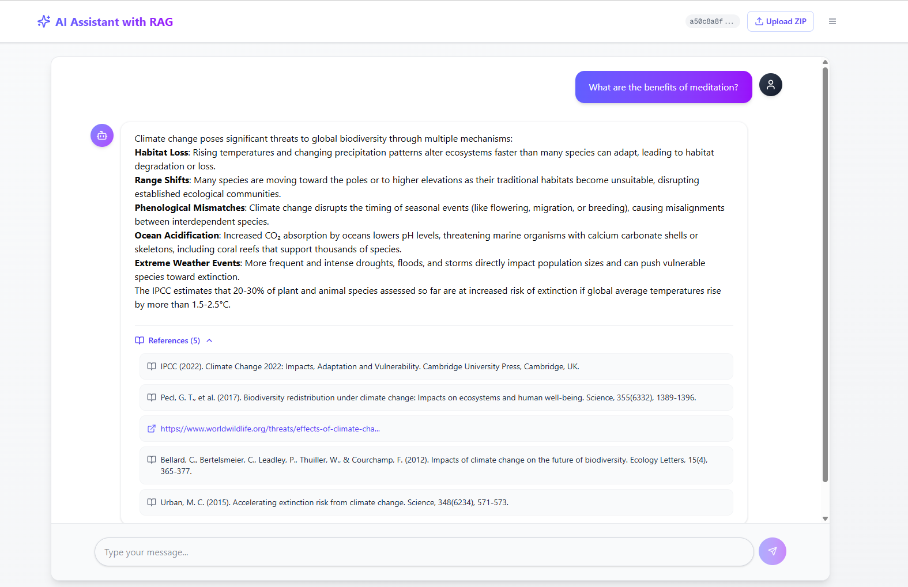

# 🚀 LLM + RAG Frontend Template

This is a **frontend template** for building a custom **Large Language Model (LLM)** and **Retrieval-Augmented Generation (RAG)** system. Designed for flexibility, speed, and modern aesthetics, this template provides a ready-to-use interface for interacting with AI models and vector-based knowledge retrieval systems.

---

## 🧠 What is LLM + RAG?

**Large Language Models (LLMs)** are advanced AI models capable of understanding and generating human-like text. **Retrieval-Augmented Generation (RAG)** enhances LLMs by incorporating external data sources through vector search, making AI outputs more factual, context-aware, and trustworthy.

This template enables:
- Domain-specific Q&A systems
- AI-powered chatbots
- Internal knowledge base assistants
- Custom GenAI tools with user-friendly UIs

---

## ✨ Features

- ✅ Modern React + Tailwind CSS stack
- ✅ Clean, responsive, and customizable interface
- ✅ Built for integration with:
  - OpenAI / Azure OpenAI
  - LangChain, LlamaIndex, or custom pipelines
  - Vector databases (Pinecone, Weaviate, FAISS)
- ✅ Easy deployment with Vite
- ✅ Document upload, citations, and chat history ready (extendable)

---

## 🖼️ Interface Preview



---

## 📦 Installation

### Step 1: Navigate to the `frontend` directory
```cd frontend```
